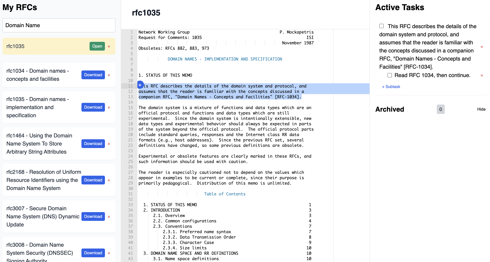

# RFC Explorer

A lightweight web application to browse, view, and manage tasks for Internet Engineering Task Force (IETF) RFC documents. Built with plain HTML, Tailwind CSS, ACE Editor, and vanilla JavaScript, RFC Explorer allows you to search and pin RFCs, read their content in a Markdown-like viewer, and create/track tasks tied to specific sections of a document.

---

## Features

- **Search RFCs**: Query the IETF Datatracker API (limit 50 results) by RFC number or title.
- **Pin RFCs**: Quickly save frequently used RFCs to your sidebar for instant access.
- **View Content**: Load the raw text of an RFC into the ACE Editor configured for Markdown display.
- **Task Management**:
  - Create tasks directly from selected text ranges in an RFC.
  - Organize tasks with subtasks.
  - Move tasks between active and archived states with ease.
  - Highlight task-associated lines in the editor for clear context.
- **Persistent Storage**: Uses `localStorage` to save pinned RFCs and task lists, so your data persists across sessions.
- **Responsive UI**: Fluid layout with a sidebar, main content area, and task pane. Styled using Tailwind CSS utility classes.

---

## Demo : [guillaumefe.github.io/rfc-explorer](guillaumefe.github.io/rfc-explorer/)



---

## Getting Started

### Prerequisites

- A modern web browser (Chrome, Firefox, Edge, Safari).
- Optional: A local HTTP server for running the app (e.g., VS Code Live Server, `http-server`, Python's `SimpleHTTPServer`).

### Installation

1. **Clone or download** this repository:  
   ```bash
   git clone https://github.com/yourusername/rfc-explorer.git
   cd rfc-explorer
   ```

2. **Serve the files** via a local HTTP server (recommended):  
   ```bash
   npm install -g http-server
   http-server .
   ```  
   Alternatively, open `index.html` directly in your browser, but note that CORS restrictions may apply.

### Usage

1. Open the application in your browser.
2. Use the search box to look up RFCs by number or keywords in the title.
3. Click **Download** on a result to fetch and display the RFC text.
4. Click **+** next to selected text in the editor to create a new task for that section.
5. Track your tasks in the **Active Tasks** and **Archived Tasks** panes.
6. Pin important RFCs for faster access using the **Open** button in the pinned list.

---

## Configuration

- **API Endpoint**: By default, the app queries `https://datatracker.ietf.org/api/v1/doc/document/?format=json&doc_type=rfc&limit=50`. You can modify `baseApi` in the \<script\> to change the limit or add filters.
- **CORS Proxy**: Uses `https://corsproxy.io` to load raw RFC text. Replace `proxyUrl` if you have your own proxy or server.

---

## Code Structure

- **HTML**: Defines three main sections:
  - Sidebar (`#dashboard`): Search input, pinned RFCs, and search results.
  - Main content: Header and ACE Editor container.
  - Task pane (`#task-pane`): Active and archived tasks.
- **CSS**: Tailwind CDN plus custom styles for task cards, highlights, and animations.
- **JavaScript**:
  - Fetch and render RFC lists.
  - Manage pinning, task creation, archival, and storage.
  - Integrate with ACE Editor to highlight task ranges.

---

## Contributing

Contributions are welcome! Please open issues or submit pull requests for bug fixes and enhancements.

---

## License

This project is licensed under the [GNU General Public License v3.0](LICENSE).

